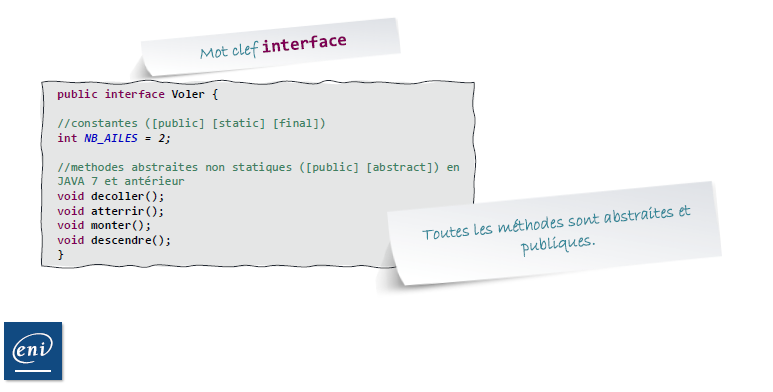
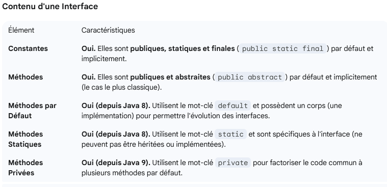
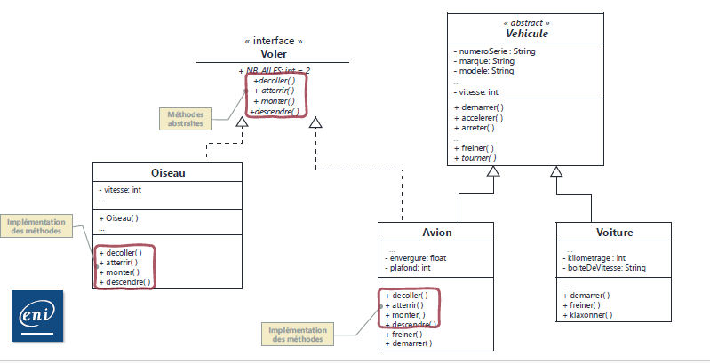
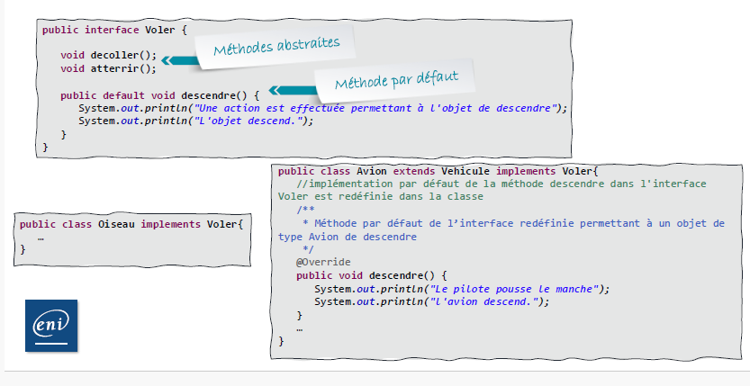
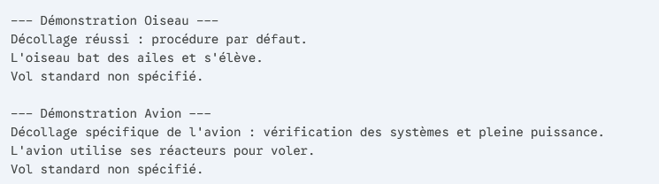

# Les interfaces

interface = "contrat sans implémentation"
On instancie pas une interface



à l'intérieur on y met (historiquement) :

- éventuellement des constantes
- des méthodes (public et abstract implicite)

En résumé avec les évolutions de JAVA :



**Transtypage : la classe implémentée obtient le type de l'interface et est considérée comme**

## La notion de contrat

Une interface propose des services mais ne prévoit pas les moyens techniques de mise en oeuvre.
Permet de normaliser les noms de fonctionnalités.

Définition : Une interface n'est pas instanciable et ses fonctionnalités sont abstraites (JDK inf 8)

    exemple :
        - Avion signe le contrat de voler() / decoller, atterir, monter, descendre
        - Oiseau signe le contrat de voler() / decoller, atterir, monter, descendre


## La mise en place d'une interface




## Pour implémenter une interface (en UML ----> flèche pointillé blanche)

Pour implementer une interface on utilise le mot clé implements
Si la classe est déjà hérité (extends), on le met à la suite


## Méthode par défaut

On peut définir le comportement par défaut d'une méthode non abstraite



### Exemple :

#### Definition de l'interface voler

```JAVA
public interface Voler {
    
    // Méthode abstraite : L'implémentation doit être spécifique à chaque classe
    void voler();
    
    // Méthode par défaut : Implémentation générique fournie, optionnelle à surcharger
    default void decoller() {
        System.out.println("Décollage réussi : procédure par défaut.");
    }
    
    // Méthode par défaut : Peut fournir des informations de base
    default String getTypeDeVol() {
        return "Vol standard non spécifié.";
    }
}
```
#### Implémentation de la Classe oiseau

```JAVA
public class Oiseau implements Voler {
    
    @Override
    public void voler() {
        System.out.println("L'oiseau bat des ailes et s'élève.");
    }
    
    // La classe hérite de decoller() et getTypeDeVol() sans les coder.
}
```

#### Implémentation de la classe Avion (Surcharge)

```JAVA
public class Avion implements Voler {
    
    @Override
    public void voler() {
        System.out.println("L'avion utilise ses réacteurs pour voler.");
    }
    
    // Surcharge de la méthode par défaut pour une implémentation spécifique
    @Override
    public void decoller() {
        System.out.println("Décollage spécifique de l'avion : vérification des systèmes et pleine puissance.");
    }
}
```

#### Execution du code (Demonstration)


```JAVA
public class Demo {
    public static void main(String[] args) {
        Voler faucon = new Oiseau();
        Voler boeing = new Avion();
        
        System.out.println("--- Démonstration Oiseau ---");
        faucon.decoller(); // Utilise la méthode par défaut de l'interface
        faucon.voler();
        System.out.println(faucon.getTypeDeVol());

        System.out.println("\n--- Démonstration Avion ---");
        boeing.decoller(); // Utilise la méthode surchargée dans la classe Avion
        boeing.voler();
        System.out.println(boeing.getTypeDeVol()); // Utilise la méthode par défaut de l'interface
    }
}
```

#### Resultat de l'execution de la demonstration



### à retenir


Les méthodes par défaut on permis :
    1. De garantir que chaque objet peut voler avec la méthode decoller()
    2. De fournir une implémentation simple et générique (Oiseau) sans obliger à écrire du code.
    3. De permettre à la classe Avion de fournir son comportement spécifique quand c'est nécessaire.


