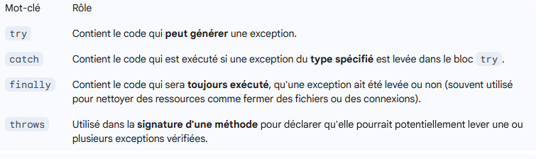
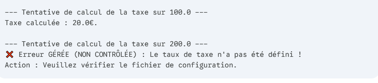
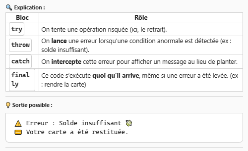

---

sidebar_position: 12

---


# Exceptions

Les exceptions sont des **évènements anormaux** qui surviennent pendant l'exécution d'un programme.
Elles sont un mécanisme fondamental pour gérer les erreurs et assurer la robustesse du code.

Par défaut le programme s'arrête


## Le traitement des exceptions

Objectif : **intercepter** une erreur et **traiter** l'excepetion afin d'éviter un arrêt de l'application

utilisation de **try catch**

### La hiérarchie des Exceptions

Toutes les exceptions **en Java dérivent de la classe java.lang.Throwable**.  
Elles se divisent en deux branches principales :
- Error     : Problèmes grraves irrécupérables(panne de mémoire, erreur système)         : pas de gestion possible
- Exception : Problèmes qui peuvent et doivent être gérés (ex : fichier non trouvé...)  : gestion possible selon les cas

#### Checked Exceptions : **exceptions controlées** ou vérifiées à corriger par le développeur

    * Elles dérivent directement de Exception (sauf RuntimeException)
    * Le compilateur oblige le dév à les gérer (try/catch) ou à les déclarer (throws)
    _Exemples : IOException, SQLException._

#### Unchecked Exceptions : **exceptions non contrôlés** ou non vérifiés

    *Elles dérivent de RuntimeException.
    * Elles ne sont pas obligatoirement gérées ou déclarées. Signalent souvent des erreurs de programmations (division par zéro, index hors limite...)
    _exemples : NullPointerException, ArrayIndexOutOfBoundsException, IllegalArgumentException._


## Mécanisme de gestion (try-catch-finally-throws)

Java utilise un bloc de construction spécifique pour intercepter et traiter les exceptions.

finally : elle n'est pas obligatoire




exemple de code SANS throws*

```JAVA
try {
    int resultat = 10 / 0; // Ceci va planter, mais le 'catch' va l'attraper
} catch (ArithmeticException e) {
    System.out.println("Erreur: Division par zéro impossible !"); // Le programme continue ici
} finally {
    System.out.println("Fin de l'opération.");
}
```
exemple de code AVEC throws*

```JAVA
// La méthode ne gère pas l'exception elle-même, elle la PROPAGÉ à l'appelant.
public void lireFichier(String nomFichier) throws FileNotFoundException { 
    // Si le fichier n'est pas là, l'exception est levée et quitte la méthode.
    FileReader fr = new FileReader(nomFichier); 
    // ... suite du code ...
}

// Le code appelant doit OBLIGATOIREMENT mettre cet appel dans un try-catch.
public static void main(String[] args) {
    try {
        lireFichier("config.txt");
    } catch (FileNotFoundException e) {
        System.err.println("Gestion par l'appelant : " + e.getMessage());
    }
}
```

### Throws 


Différence entre Throw et Throws


## Créer et Lever des Exceptions

1. Lever (Throwing)

Throw permet de faire remonter l'exception afin d'alerter sur le fait d'appliquer une méthode pour la gérer

Utiliser l'instruction throw (sans 's') pour déclencher manuellement une exception :

```JAVA
if (age < 0) {
    throw new IllegalArgumentException("L'âge doit être positif.");
}
```
2. Créer (Custom)

Vous pouvez créer vos propres exceptions personnalisées en étendant :

    Exception pour une Checked Exception.

    RuntimeException pour une Unchecked Exception.

### Les exceptions controlées personnalisées (p-177) / vérifiée

Création de classe hérité(extends) de la classe standard Exception

Exemple :

```JAVA
// 1. Définition de l'exception contrôlée
public class SoldeInsuffisantException extends Exception {

    // Constructeur qui prend un message pour détailler l'erreur
    public SoldeInsuffisantException(String message) {
        super(message);
    }
}
```

La méthode qui appelle cette classe

```JAVA
public class CompteBancaire {
    private double solde;

    public CompteBancaire(double soldeInitial) {
        this.solde = soldeInitial;
    }

    // La méthode utilise 'throws' pour déclarer qu'elle propage l'exception vérifiée.
    public void retirer(double montant) throws SoldeInsuffisantException {
        
        System.out.println("\n--- Tentative de retrait de " + montant + " ---");
        
        if (montant > solde) {
            // Lève l'exception personnalisée si la condition est fausse
            double manque = montant - solde;
            throw new SoldeInsuffisantException("Retrait impossible : manque " + manque + "€.");
            
        } else {
            // Si la condition est bonne, on effectue l'opération
            solde -= montant;
            System.out.println("Opération réussie. Nouveau solde : " + solde + "€.");
        }
    }
    
    public double getSolde() {
        return solde;
    }
}
```

Utilisation et gestion de l'exception

```JAVA
public class Application {

    public static void main(String[] args) {
        CompteBancaire monCompte = new CompteBancaire(500.00);

        // Cas 1 : Succès
        try {
            monCompte.retirer(100.00); 
        } catch (SoldeInsuffisantException e) {
            System.err.println("ERREUR : " + e.getMessage());
        }
        
        // Cas 2 : Échec (provoque l'exception personnalisée)
        // Le compilateur nous OBLIGE à mettre ce code dans un try-catch.
        try {
            monCompte.retirer(800.00); 
        } catch (SoldeInsuffisantException e) {
            // Bloc catch spécifique pour notre exception métier
            System.err.println("❌ Échec de la transaction : " + e.getMessage());
            System.out.println("Votre solde actuel est de : " + monCompte.getSolde() + "€.");
        } finally {
            System.out.println("Fin de la tentative de retrait.");
        }
    }
}
```

Résultat de l'exécution


Exemple de l'ENI :


### Les exceptions non controlées personnalisées (p180) / non vérifiée

Création de classe hérité(extends) de la classe standard RuntimeException
_ex :

Exemple :

Classe

```JAVA
// 1. Définition de l'exception non contrôlée
public class ConfigurationInvalideException extends RuntimeException {

    // Constructeur qui prend un message pour détailler l'erreur
    public ConfigurationInvalideException(String message) {
        super(message);
    }
}
```

La méthode qui appelle cette classe

```JAVA
public class CalculateurTaxe {
    private Double tauxActuel; // Peut être null si non configuré

    public void setTaux(Double taux) {
        this.tauxActuel = taux;
    }

    // Pas de 'throws' car l'exception est UNCHECKED (RuntimeException)
    public double calculerTaxe(double montant) {
        
        System.out.println("\n--- Tentative de calcul de la taxe sur " + montant + " ---");
        
        if (tauxActuel == null) {
            // Lève l'exception non contrôlée si le taux n'est pas configuré.
            // C'est une erreur de "devrait pas arriver" / "mauvaise configuration".
            throw new ConfigurationInvalideException("Le taux de taxe n'a pas été défini !");
        }
        
        return montant * tauxActuel;
    }
}
```

Utilisation et gestion de l'exception

```JAVA
public class Application {

    public static void main(String[] args) {
        CalculateurTaxe calculateur = new CalculateurTaxe();

        // Cas 1 : Succès (Configuration OK)
        calculateur.setTaux(0.20);
        double taxe1 = calculateur.calculerTaxe(100.00);
        System.out.println("Taxe calculée : " + taxe1 + "€.");

        // Cas 2 : Échec (Erreur de configuration - Exception non contrôlée levée)
        // Nous choisissons de ne PAS utiliser de try-catch ici pour montrer que le code compile.
        // MAIS : l'application va s'arrêter brutalement lors de cette ligne si elle est exécutée.
        
        calculateur.setTaux(null); // Réinitialisation pour simuler l'oubli de configuration

        try {
             // L'utilisation de try-catch est optionnelle ici !
             calculateur.calculerTaxe(200.00); 
        } catch (ConfigurationInvalideException e) {
             // Nous avons attrapé l'erreur pour empêcher le crash, mais nous n'y étions pas obligés.
             System.err.println("❌ Erreur GÉRÉE (NON CONTRÔLÉE) : " + e.getMessage());
             System.out.println("Action : Veuillez vérifier le fichier de configuration.");
        } 
    }
}
```

Résultat de l'exécution




exemple courrant :

try {
    verser de l’eau dans la cafetière
    ajouter du café moulu
    allumer la cafetière
    servir le café dans une tasse
} catch (Erreur) {
    si pas d’eau -> aller remplir la carafe
    si pas de café -> aller en acheter ou prendre du thé
    si panne de courant -> utiliser une cafetière à piston
}

exemple chat GPT (Julien) :


```JAVA
class CarteBancaire {
    boolean valide;
    double solde;

    CarteBancaire(boolean valide, double solde) {
        this.valide = valide;
        this.solde = solde;
    }
}

class Distributeur {
    double argentDisponible;

    Distributeur(double argentDisponible) {
        this.argentDisponible = argentDisponible;
    }

    // Méthode qui peut lancer une exception
    void distribuerArgent(CarteBancaire carte, double montant) throws Exception {
        if (!carte.valide) {
            throw new Exception("Carte invalide ❌");
        }

        if (carte.solde < montant) {
            throw new Exception("Solde insuffisant 💸");
        }

        if (montant > argentDisponible) {
            throw new Exception("Machine vide ou montant trop élevé 🏧");
        }

        // Si tout est OK :
        carte.solde -= montant;
        argentDisponible -= montant;
        System.out.println("✅ Retrait réussi de " + montant + " €");
    }
}

public class ExempleTryCatchThrow {
    public static void main(String[] args) {
        CarteBancaire carte = new CarteBancaire(true, 50.0);
        Distributeur distributeur = new Distributeur(500.0);

        try {
            distributeur.distribuerArgent(carte, 100.0);
            System.out.println("Merci d’avoir utilisé notre service !");
        } 
        catch (Exception e) {
            System.out.println("⚠️ Erreur : " + e.getMessage());
        } 
        finally {
            System.out.println("💳 Votre carte a été restituée.");
        }
    }
}
```

