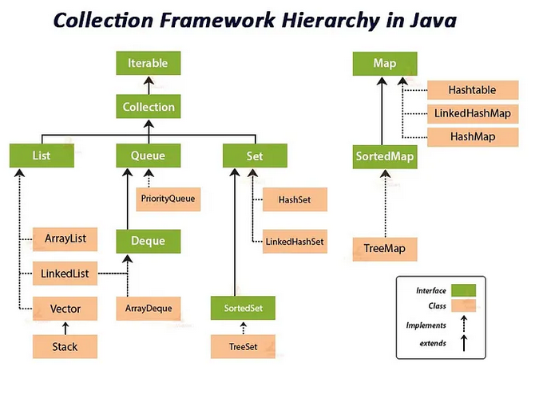
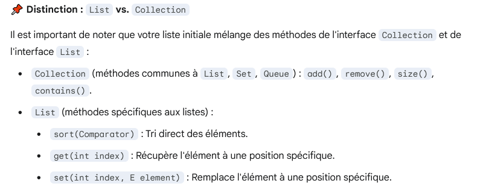

---

sidebar_position: 13

---

# Les Collections

Regrouper un ensemble d'objet et de type dans un seul endroit

Ce type de schéma met en évidence les points clés :

1. Interfaces Mères : Iterable (la racine), Collection (le conteneur de base), et Map (le conteneur Clé-Valeur, séparé de Collection).

2. Branches Principales : List, Set, et Queue qui héritent de Collection.

3. Classes Concrètes : Les rectangles ou formes en bas représentent les implémentations que vous utilisez concrètement (ex: ArrayList, HashSet, HashMap, LinkedList).

**Les éléments qui hérite de collections peuvent utiliser Collections :**
 - add(), remove(), sort(), size(), contains()

 

 

## Set (Ensemble)

Chaque élément sera unique
Généralement non ordonnée (sauf LinkedHashSet ou TreeSet).	HashSet, TreeSet

## Map : Tableau associatif (dictionnaire)

Association clé/Valeur avec des clés unique
Chaque élément est identifié par une clé
Généralement non ordonnée (sauf LinkedHashMap ou TreeMap).
HashMap, TreeMap

## List 

Accepte les doublons.
Ordonnée (L'ordre d'insertion est préservé).
ArrayList, LinkedList

## Queue (File)

Accepte les doublons.
Ordonnée par l'ordre de traitement (FIFO ou Priorité).
LinkedList, PriorityQueue

## A RETENIR :

Points Clés à retenir

    List : Quand l'ordre et l'accès par index sont importants.

    Set : Pour garantir l'unicité des éléments.

    Queue : Pour gérer des éléments en attente de traitement (tâches, événements).

    Map : Pour la recherche rapide d'une valeur via une clé.

