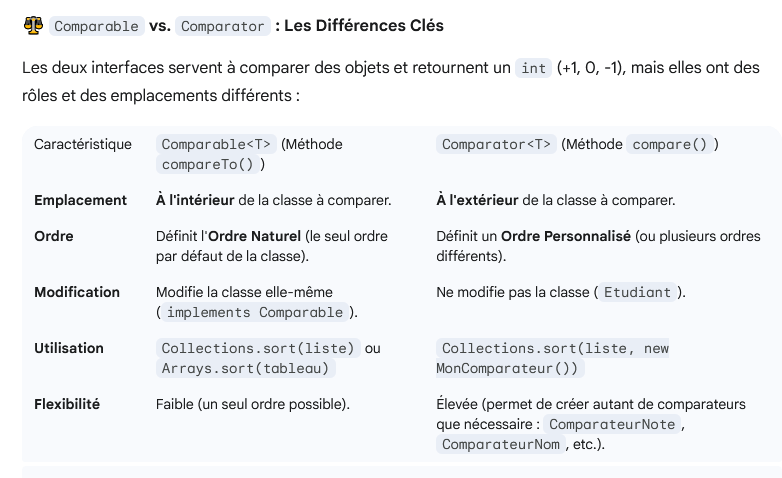

---

sidebar_position: 14

---

# Généricité

définir le type de l'attribut au moment de l'instanciation de la classe.

T ne peut être qu'un objet :

Les types génériques "T" ne peuvent pas être des types primitifs il faut utiliser des classe wrapper :
boolean : Boolean
int : Integer
long : Long
char : Character
double : Double
...


1- Mettre un mot qui n'existe pas dans les types "Blop" (la norme c'est de mettre <T>)
2- on met class Attribute <Blop> (Dans la norme on met Attribute <T>)
3- Ce qui donne :
 - Attribute a1 = new Attribute<Integer>
 - Attribute a1 = new Attribute<String>

4- S'il y en a plusieurs <T, U, V, W...> ou autre mot clé du contexte et respecter l'ordre

 ```JAVA
package entrainement;

class Attribute<T, U> {

    public String name;
    public T value;
    public U categorie;
}

public class DemoGenericApp {

    public static void main(String[] args) {

        // 1. Définition : T=Integer, U=String
        // Le type de 'value' sera Integer.
        Attribute<Integer, String> a1 = new Attribute<Integer, String>();
        a1.value = 1; // OK, 1 est un Integer
        // a1.value = "Erreur"; // ERREUR de compilation : String n'est pas Integer

        // 2. Définition : T=String, U=Boolean
        // Le type de 'value' sera String.
        Attribute<String, Boolean> a2 = new Attribute<>(); // L'opérateur "Diamond" <> déduit les types
        a2.value = "Ceci est une chaîne"; // OK, "Ceci est une chaîne" est un String
        
        // 3. Définition : T=Boolean, U=Double (exemple)
        // Le type de 'value' sera Boolean.
        Attribute<Boolean, Double> a3 = new Attribute<>();
        a3.value = true; // OK, true est un Boolean
    }
    
}

 ```


## Comparator

2 CHOIX :

1. Soit on rends la classe comparable implements Comparable 
2. Soit on créé nue classe Comparator implements Comparator



1. Rendre la classe comparable

Implémenter quand il existe un seul ordre "évident pour les objets de la classe.


```JAVA
public class Etudiant implements Comparable<Etudiant> {
    private String nom;
    private int note;

    public Etudiant(String nom, int note) {
        this.nom = nom;
        this.note = note;
    }
    // ... Getters et Setters
}
```

CompareTo :

retourne 0 : si identique
retourne +1 : L'objet courant est supérieur à l'objet passé en paramètre (this > other)
retourne -1 : L'objet courant est inférieur à l'objet passé en paramètre (this < other).

On surcharge la methode compareTO

```JAVA
@Override
    public int compareTo(Etudiant autreEtudiant) {
        // 1. Comparaison par la note (ordre ascendant)
        if (this.note < autreEtudiant.note) {
            return -1;
        } else if (this.note > autreEtudiant.note) {
            return 1;
        } else {
            // 2. Si les notes sont égales, utiliser un critère secondaire (le nom)
            // Utilise la méthode compareTo() native de la classe String
            return this.nom.compareTo(autreEtudiant.nom);
        }
    }

```
Pour comparer les types primitifs numériques (int, double, etc.), utilisez les méthodes statiques des classes enveloppes pour un code plus concis (disponible depuis Java 7) :

```JAVA
// Ceci est équivalent à la logique if/else ci-dessus
return Integer.compare(this.note, autreEtudiant.note);
```

**Utilisation**

Une fois l'interface Comparable implémentée, vous pouvez trier une liste de ces objets directement en utilisant la méthode statique Collections.sort() :

```JAVA
import java.util.ArrayList;
import java.util.Collections;
import java.util.List;

// ... La classe Etudiant est définie comme ci-dessus

public class DemoComparaison {
    public static void main(String[] args) {
        List<Etudiant> etudiants = new ArrayList<>();
        etudiants.add(new Etudiant("Alice", 15));
        etudiants.add(new Etudiant("Bob", 12));
        etudiants.add(new Etudiant("Charlie", 15));

        // Trie la liste en utilisant l'ordre défini dans compareTo() (Note croissante)
        Collections.sort(etudiants); 
        
        // ... Affichage des résultats triés
    }
}
```

2. Classe Comparator :


Comparator est la solution préférée en POO moderne car elle applique le principe de **la Séparation des Préoccupations (SRP)** : la classe Etudiant gère les données, tandis que la classe Comparateur... gère la logique de tri.

```JAVA
package model;
import java.util.Comparator;
public class ComparateurSurface implements Comparator<Forme> {

    @Override
    public int compare(Forme f1, Forme f2) {
        // Tri croissant basé sur la surface retournée par calculerSurface()
        return Double.compare(f1.calculerSurface(), f2.calculerSurface());
    }
}
```

```JAVA
public class Main {

    // Méthode factorisée pour afficher n'importe quelle liste de Formes
    private static void afficherListe(String titre, ArrayList<Forme> formes) {
        System.out.println(String.format("\n### %s ###", titre));
        for (Forme forme : formes) {
            forme.afficherDescription();
            System.out.println("-------------");
        }
    }

    public static void main(String[] args) {

        Cercle c1 = new Cercle("Cercle Bleu", 5.0);
        Cercle c2 = new Cercle("Cercle Vert", 8.0);
        Rectangle r1 = new Rectangle("Rectangle jaune", 5.0, 6.5);
        Rectangle r2 = new Rectangle("Rectangle orange", 6.0, 7.5);

        ArrayList<Forme> mesFormes = new ArrayList<>();
        Collections.addAll(mesFormes, c1, c2, r1, r2);

        //Exemple de tri
        Collections.sort(mesFormes, new ComparateurSurface());
        afficherListe("------Tri par Surface------", mesFormes);

        Collections.sort(mesFormes, new ComparateurNom());
        afficherListe("------Tri par Nom------", mesFormes);


    }

}
```

Syntaxe Moderne (Lambdas)

Il est important de noter qu'en Java 8 et versions ultérieures, la création de Comparator est grandement simplifiée grâce aux expressions Lambda, rendant l'écriture de comparateurs très concise :

```JAVA
// Tri par Note (au lieu de créer une classe ComparateurNote)
Collections.sort(mesFormes, (f1, f2) -> Double.compare(f1.calculerSurface(), f2.calculerSurface()));

// Ou encore mieux, en utilisant les méthodes par défaut de Comparator
mesFormes.sort(Comparator.comparing(Forme::getNom));
```
