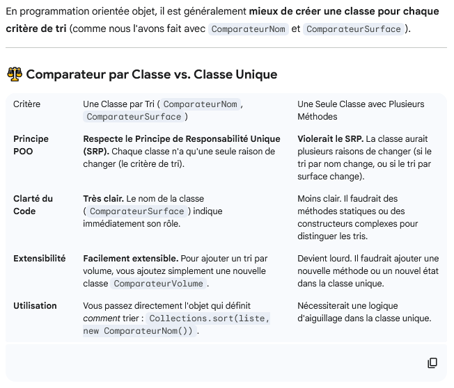
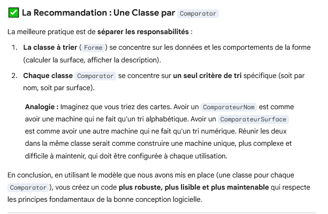

# Array List

## Créer une ArrayList
Arraylist est une class qui permet de gérer un liste dynamique :
* Il faut donc l'importer 
* Il faut mettre entre crochet le type de la liste
* en camelCase 
* pluriels ou ajouter le mot List (ex : firstnames ou firstnameList)

**il faut donc l'initialiser, l'instancier + LISTE VIDE**

```JAVA
import java.util.ArrayList;

public class DemoArrayApp {
    public static void main(String[] args) {
        // on initialise une liste de prenom vide
        ArrayList<String> firstnames = new ArrayList<String>();
    }
}
```

## Ajouter un élément .add()

```JAVA
import java.util.ArrayList;

public class DemoArrayApp {
    public static void main(String[] args) {
        // on initialise une liste de prenom vide
        ArrayList<String> firstnames = new ArrayList<String>();

         // ajouter un nom
        firstnames.add("Léo");
        firstnames.add("Rafael");
    }
}
```

## Boucle For pour Array List

Écriture simplifier :  
for (type nomVariableSubjectif : maListe){}

```JAVA
for (String firstname: firstnames){
            System.out.println(firstname);
        }
```

## Démo Array List :

### Class Viennoiserie 
```JAVA
package demoarray2;

import java.util.ArrayList;

public class Viennoiserie {
    // Le nom de la viennoiserie
    public String name;

    // constructeur
    public Viennoiserie (String name){
        this.name = name;
    }
    public Viennoiserie (){
    }
}

```

### Class Boulangerie 

La class boulangerie aura en attribut une array List de type Viennoiserie

```JAVA
package demoarray2;

import java.util.ArrayList;

public class Boulangerie {
    // nom de la Boulangerie
    public String name;

    // Il y a DES viennoieries dans ma Boulangerie
    public ArrayList<Viennoiserie> viennoiseries;
    //On peut initialiser ici ou dans le constructeur
    // public ArrayList<Viennoiserie> viennoiseries = new ArrayList<Viennoiserie>();

    // Constructeur
    // IMPORTANT : créer une liste vide : instancier une liste pour qu'elle ne soit plus à null
    public Boulangerie(String name) {
        this.name = name;
        viennoiseries = new ArrayList<Viennoiserie>();
    }

    public Boulangerie() {
        viennoiseries = new ArrayList<Viennoiserie>();
    }
}
```

### App (Main) 
```JAVA
package demoarray2;

import java.util.ArrayList;

public class DemoArrayApp2 {
    public static void main(String[] args) {

        // J'instancie une Boulangerie avec mon constructeur
        Boulangerie b1 = new Boulangerie("Fournil du 44");
        Boulangerie b2 = new Boulangerie("Fournil du 49");

        /* créer une boulangerie sans constructeur prends plus de ligne de code
        Boulangerie b1 = new Boulangerie();
        b1.name = "Fournil du 44";
        b1.viennoiseries = new ArrayList<Viennoiserie>();
         */

        // ------------------- Ajouter en 2 temps ------------------------
        // 1- Instancier (créer) des viennoiseries
        // avec le constructeur
        Viennoiserie croissant = new Viennoiserie("Croissant");
        // avec le constructeur vide (qui remplace celui par défaut)
        Viennoiserie painAuChocolat = new Viennoiserie();
        painAuChocolat.name = "Pain au Chocolat";

        // 2- ajouter les viennoiseries à la liste de ma boulangerie
        b1.viennoiseries.add(painAuChocolat);
        b1.viennoiseries.add(croissant);
        b2.viennoiseries.add(croissant);

        // ------------------- Ajouter en 1 fois ------------------------
        // il faut juste avoir un constructeur pour la viennoiserie sinon elle n'a pas de nom (paramètre)
        b1.viennoiseries.add(new Viennoiserie("Brioche"));

        //---------------------Bonus : question pour 2 boulangerie---------
        // soit une variable par vienoiserie voir ligne 21 ou si besoin :
        // pour récupérer la brioche ligne 33, il faudra faire :
        Viennoiserie brioche = b1.viennoiseries.get(2);
        // cela permettra de récupérer la brioche d'une autre boulangerie et pas avoir 2 brioches différentes
        // sinon on aurait deux adresse mémoire pour la même vienoiseir
        System.out.println(brioche.name);
        b2.viennoiseries.add(brioche);
    }
}
```
## Infos primitifs et ArrayList

On ne peut pas faire une ArrayList de primitif  
entre les balises on doit mettre des classes.
Pour utiliser un primitif il faut donc mettre une majuscule (ex: Float, Double...) c'est JAVA qui a créé des classes spéciales

```JAVA
  // Exemple de classes spéciales java pour encapsuler des primitifs dans une classe
        Integer unInt = 10;
        Float unFloat = 12.0f;
        Boolean unBoolean = false;
        Double unDouble = 12.0;

        // Impossible
        // ArrayList<float> desFloats = new ArrayList<float>();

        // Si on veut faire des listes de valeur "primitif"
        // Il faut utiliser des classes spéciales de java
        // Ex: String, Float, Double, Boolean, Integer, etc
        ArrayList<Float> desFloats = new ArrayList<Float>();
        ArrayList<Double> desDoubles = new ArrayList<Double>();
```

## Ajouter plusieurs éléments d'un coups :

Collections.addAll(playerTeam.battlers, ...)

```JAVA
package rpg;
import java.lang.Math;
import java.util.Collections;

public class AppRPG {
    public static void main(String[] args) {
        //créer Team
        Team enemyTeam = new Team("Orc");
        Team playerTeam = new Team("Human");

        // créer un Battler
        Battler orc1 = new Battler("Babe");
        Battler human1 = new Battler("John");
        Battler orc2 = new Battler("Azog");
        Battler human2 = new Battler("Nova");
        Battler orc3 = new Battler("Snaga");
        Battler human3 = new Battler("Iraltré");
        Battler human4 = new Battler("Andy");
        Battler human5 = new Battler("Arthur");


        // ajouter Battler à une team
        enemyTeam.battlers.add(orc1);
        enemyTeam.battlers.add(orc2);
        enemyTeam.battlers.add(orc3);
        Collections.addAll(playerTeam.battlers, human1, human2, human3, human4, human5);
    }
}
```

## Bonus tri array list

utilisation du comparator

```JAVA
import java.util.Comparator;

        characters.sort(Comparator.comparing(Characters::getName)); // ordre alphabetique
        for (Characters c : characters) {
            c.showInfo();
        }

        characters.sort(Comparator.comparing(Characters::getName).reversed()); // ordre inverse
        for (Characters c : characters) {
            c.showInfo();
        }
```

```JAVA
    // déclaration de getters pour le tri par la suite
    public String getName() {
        return this.name;
    }
```

### tri avec des classes séparés pour les methodes de tri :

On déclare une class pour la method compare par nom et une pour la methode compare par surface

```JAVA
package model;
import java.util.Comparator;
public class ComparateurSurface implements Comparator<Forme> {

    @Override
    public int compare(Forme f1, Forme f2) {
        // Tri croissant basé sur la surface retournée par calculerSurface()
        return Double.compare(f1.calculerSurface(), f2.calculerSurface());
    }
}


```

```JAVA
package model;

import java.util.Comparator;

// Cette classe définit comment comparer deux objets Forme par leur nom
public class ComparateurNom implements Comparator<Forme> {

    @Override
    public int compare(Forme f1, Forme f2) {
        // Tri alphabétique croissant basé sur le nom (String.compareTo())
        // Assurez-vous que la classe Forme a une méthode getName()
        return f1.getName().compareTo(f2.getName());
    }
}
```

On appelle la méthode dans le main en deuxième paramètre de .sort

```JAVA
import model.*;

import java.util.ArrayList;
import java.util.Collections;

public class Main {

    public static void main(String[] args) {

        Cercle c1 = new Cercle ("Cercle Bleu", 5.0);
        Cercle c2 = new Cercle ("Cercle Vert", 8.0);
        Rectangle r1 = new Rectangle("Rectangle jaune", 5.0,6.5);
        Rectangle r2 = new Rectangle("Rectangle orange", 6.0,7.5);

        ArrayList <Forme> mesFormes = new ArrayList<>();
        Collections.addAll(mesFormes,c1,c2,r1,r2);

        //Exemple de tri
        System.out.println("-------TRI------");
        Collections.sort(mesFormes, new ComparateurSurface());
        for (Forme forme : mesFormes){
            forme.afficherDescription();
            System.out.println("-------------");
        }

    }
}
```

### Pourquoi créer une classe par methode de tri ?



