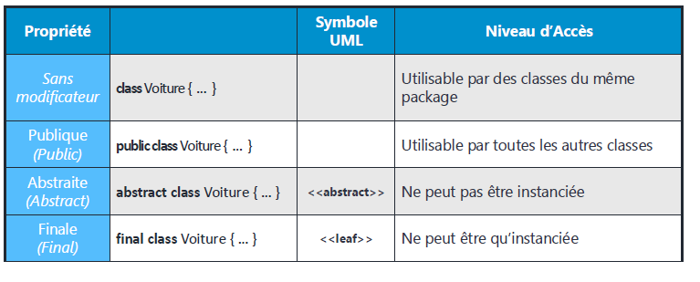
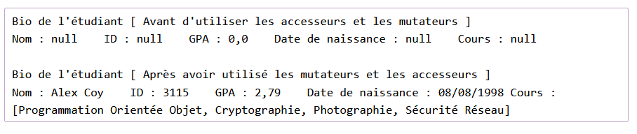
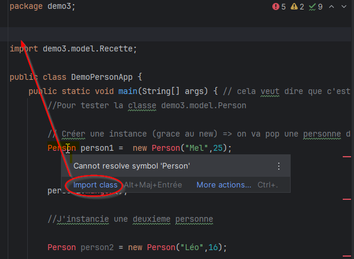

# Intro JAVA POO

Objet = Concept issu du monde réel

lien fort entre :
- Les données
- Les traitements
- interdit de mettre des class sans la racine de Src

## Convention de nommage :
- nom fichier : en minuscule pas de separateur
- nom class : PascalCase
- nom fonction, attribut, variable : camelcase
  

## Organisation / package
les sous-dossier sont dans "src" obligatoirement
Un sous-dossier = package que l'on appelera en haut di fichier
des sous-dossiers = des packages

### visibilité des package / encapsulation

**intérêt seulement en équipe**
Si on a plusieurs dossiers, pensez à dire :
- Public (+) : On peut accéder partout
- Private(-) : On peut accéder que dans la classe
- Protected (#): On peut accéder que dans la classe et les héritages
- _Package Private (par défaut) (~) : on peut accéder dans le même dossier / ne s'écrie pas_

info sur la visibilité / encapsulation : (débat sur l'utilité, c'est pour l'humain)

private public n'existe pas dans l'assembleur, c'est du binaire :
**Confidentialité != de sécurité**
private public c'est la confidentialité du code cela permet de mettre des barrières visuels sur comment on modifie des valeurs.  
 (exemple si on développe en partenariat avec une autre entreprise ou autre équipe) mais en soit on peut modifier le code.
_private indique : ne change pas la valeur de cete variable_
_permet de communiquer dans l'équipe, et peut montrer qu'il faut appeler une fonction pour faire une action spécifique par exemple_

#### Getter/setter : "se forcer à faire du code propre"
**s'adapter à la méthodologie de l'entreprise**
juste copier/coller et ajouter get/set puis le return
**On peut générer les getters / setters  de tous les attributs avec un clic droit**

getter/setter nexiste dans les nouveaux langages mais ils sont générés par défaut en cachette... pas en JAVA

### import package
Si la classe n'est pas importer automatiquement, survoler la class qui est en rouge
on peut l'importer s'il est dans un package

## A RETENIR

**important** 
C++ = Pointeur / **Java = referencer** ce n'est pas copier/coller
Les classes sont liées à une adresse mémoire !!
Quand on met un égale entre 2 instances cela devient la même adresse et pas juste la valeur qui change !
l'instance/la variable est donc relié à une adresse mémoire (>"c'est un alias") pour y accéder

**En java toutes les classes sont un OBJECT**

GC : Garbage Collector : supprimer les données non relitée aux variables de ma mémoire du pc ! en JAVA

Conception via la modelisation uml

!

