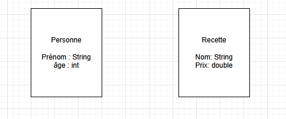
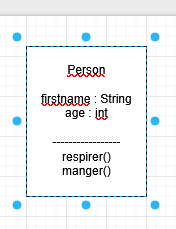
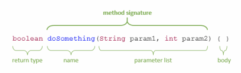
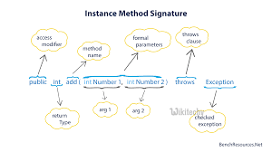

# Les classes et instances

Toutes classes instanciées est associées à une adresse mémoire

## Classe ("on déclare") : "en PascalCase"

Définition d'ensemble de données et de fonctions
Tout est une classe en informatique
Une classe est un type qui a des types
Une classe sert à une seul chose :
    - elle ne peut pas gérer et l'interface utilisateur et le tri et le calcul
**Ne pas mettre de class dans la racine de /src**

!!

```JAVA
public class Person {
    //Attributs
    String firstname;
    int age;
}
```
```JAVA
public class Recette {
    String name;
    double price;
}
```

### Attribut (=variable) :
C'est une variable qui est dans une classe

### Constructor / Constructeur

Permet d'instancié directement une instance avec l'ensemble des attributs souhaités
C'est une fonction qui a le même nom que la class (public) pour éviter de créer l'instance et les attributs un par  un.
Ce qui est important dans le paramètre c'est le type et pas le nom de la variable

**C'est une fonction appelé quand on instancie**
Pour mettre les données/attribut en une seule ligne dans notre "main"


```JAVA
public class Person {
    //Attributs
    String firstname;
    int age;

    // Constructeur pour éviter dans l'application de créer chaque attribut
    // fonction avec le Même nom que la class
    // le nom du paramètre est subjectif, juste pour le développeur
    public Person(String firstname, int age) {
        this.firstname= firstname; // on met le this car le nom du paramètre à le même nom qu'une variable déclaré
        this.age = age;
    }
}
```

#### Les paramètres du constructeur

Il faut **respecter le nombre de paramètres** quand on **appelle le constructeur** / instancie

**IMPORTANT PARAMETRES : ORDRE ET TYPAGE**


Si le nom du paramètre est identique à une variable déclarée, il faudra utiliser this.

```JAVA
    public Person(String firstname, int _age) {
        this.firstname= firstname; // on met le this car le nom du paramètre à le même nom qu'une variable déclaré
        age = _age; //pas besoin du this car pas de variable du nom de "_age"
    }
```
#### Le Constructeur par défaut en JAVA
Une classe possède un constructeur vide caché par défaut (implicite) : Person person 1 = new Person().
En JAVA quand tu créé un construteur, ça supprime le constructeur par défaut.
Si on veut garder le droit de créer par nous même il faut faire une méthode vide en plus de notre constructeur :

**toujours en créér un vide**

```JAVA
public Person() {
    }
```

permettra de faire : 
```JAVA
Person person3 =  new Person();
    
```


### Méthodes (=fonctions) :
Des fonctions qui sont dans une classe



```JAVA
    //methode / fonctionnalité
    void manger() {
        System.out.println("Je mange");
    }
    void respirer() {
        System.out.println("Je respire");
    }

```

#### Méthode signature (idem pour constructeur)

La méthode existe déjà si tout est déjà dans le même type et le même ordre  
On peut avoir un nom de constructeur ou de méthode identique si le type ou paramètre est différent






### Membres :
Ensemble des attributs, des méthodes et des constructeurs de la classe


## Instance : ("on fait poper la données")
Un ensemble, une déclaration de notre classe.
On donne une valeut à nos types de données.
**Une instance = une autre instance** n'est **pas un copier/coller** 
mais cela va **référencer** à la même **adresse mémoire**.

Si la valeur est null : il n'y a pas d'adresse mémoire associée donc si on veut le modifier "ça crash" -> erreur afficher : **_.NullPointerException_**


```JAVA
public class DemoPersonApp {
    public static void main(String[] args) { // cela veut dire que c'est un programme qui se lance
        //Pour tester la classe Person

        // Créer une instance (grace au new) => on va pop une personne dans notre monde
        Person maVariable =  new Person();
        maVariable.firstname = "Léa";
        maVariable.age = 21;

        //J'instancie une deuxieme personne

        Person maPerson2 = new Person();
        maPerson2.firstname = "Léo";
        maPerson2.age = 16;

    }

}
```
