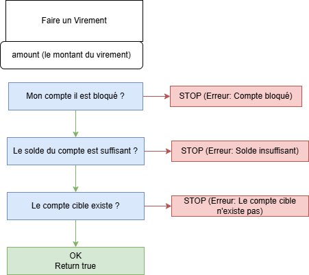

# Methodes
_voir fichier demoJavaIsaac_  

- Séparer les méthode qui font des calculs des méthodes qui affiche (display)
Comment créer une méthode qui retourne 2 types (ex boolean et String) ?  
- Créer une classe avec 2 attributs (ex boolean et String)

Création de la classe

```JAVA
package demotrainning;

public class RetourTraitement {
    /**
     * Savoir si ça marche ou pas
     */
    public boolean success;
    /**
     *  Le message du traitement
     */
    public String message;
}
```

DémonStration de l'utilisation

```JAVA
 public static RetourTraitement virement(int amount) {
        //Simuler que le compte n'est pas bloqué
        boolean lockedAccount = false;
        //Simuler le comte cible n'est pas bloqué
        boolean targetAccountExist = true;
        //simuler un solde
        int solde = 3500;

        // on inversa la condition de l'ancienne méthode
        // si le compte est bloqué (STOP ERREUR)
        if (lockedAccount) {
            RetourTraitement retourTraitement = new RetourTraitement();
            retourTraitement.success = false;
            retourTraitement.message = "Erreur: compte bloqué";
            return retourTraitement;
        }
          // si le compte est bloqué (STOP ERREUR)
        if (amount > solde) {
            RetourTraitement retourTraitement = new RetourTraitement();
            retourTraitement.success = false;
            retourTraitement.message = "Erreur: solde inssuffisant";
            return retourTraitement;
        }
        return true;
 }
```

Démonstration avec un constructeur pour nettoyer le code

````JAVA
package demotrainning;

public class DemoBankApp {
    /**
     * La fonctionnalité pour faire un virement
     *
     * @param amount
     */
    public static RetourTraitement virement(int amount) {
        //Simuler que le compte n'est pas bloqué
        boolean lockedAccount = false;
        //Simuler le comte cible n'est pas bloqué
        boolean targetAccountExist = true;
        //simuler un solde
        int solde = 3500;

        // on inversa la condition de l'ancienne méthode
        // si le compte est bloqué (STOP ERREUR)
        if (lockedAccount) {
            return new RetourTraitement(false, "Erreur : compte bloqué");
        }
        // si le compte est bloqué (STOP ERREUR)
        if (amount > solde) {
            return new RetourTraitement(false, "Erreur: solde inssuffisant");
        }

        return true;

    }
}
````




