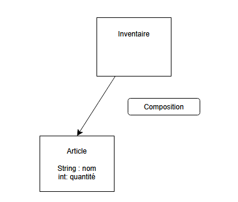
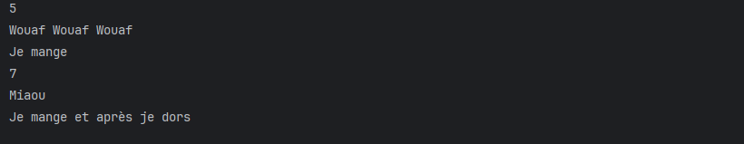
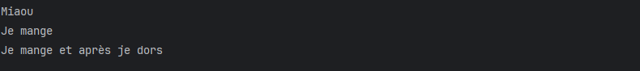

# L'Héritage 

en uml fleche blanche enfant -> Parents


**On ne peut pas faire d'héritage multiple en JAVA**,
on ne peut hérité que d'une seule classe

Permet de ne pas copier les attributs 
Ne pas confondre héritage et composition

Le mot clé super. permet de faire appel à un membre public ou protégé de la classe parent

> Héritage  


> Compositon  

 

## Ecriture en JAVA

Classe parent

```JAVA
package demoheritage;

public class Animal {
    public int age;
}

```
Class enfant

```JAVA
package demoheritage;

public class Chien extends Animal{
    
    public void aboyer(){
        System.out.println("Wouaf Wouaf Wouaf");
    }
}
```

```JAVA
package demoheritage;

public class Chat extends Animal{

    public void miauler(){
        System.out.println("Miaou");
    }
}

```
Application (Démo)

```JAVA
package demoheritage;

public class DemoHeritageApp {

    public static void main(String[] args) {

        // CHIEN
        Chien chien = new Chien();
        System.out.println(chien.age); // attribut issu de la classe parent ANIMAL
        chien.aboyer();

        //CHAT
        Chat chat = new Chat();
        System.out.println(chat.age);// attribut issu de la classe parent ANIMAL
        chat.miauler();
    }
}

```

## Constructeur

Fonction qui permet d'instancier un objet  
Il a le meme nom que la classe  
Pas besoin de type de retour
Peut être public, private, protected

Quand on déclare un constructeur il vient écraser celui par défaut.  
Dans la signature l'ordre des paramètres est important

### Le Chainage des constructeurs (mot clé super)

utilisation du super(attributs parents)

Classe parent
```JAVA
 //constructeur
    public Forme(String name) {
        this.name = name;
    }
```  

Classe enfant
```JAVA
public Cercle (String name, double rayon) {
            super(name);
            this.rayon = rayon;
        }
```

### Deux solutions

Si on fait le constructeur dans la classe parent  :
- mettre un constructeur vide par défaut dans les classes enfants (car celui par défaut est écrasé)
- reutiliser le constructeur du parent

Constructeur dans la classe Parent

```JAVA
package demoheritage;

public class Animal {
    public int age;
    public String name;

    public Animal(int age, String name) {
        this.age = age;
        this.name = name;
    }
}


```
Constructeur dans la classe enfant

```JAVA
package demoheritage;

public class Chien extends Animal{

    public Chien(int age,String name) {
        //Solution 1 : j'utilise le constructeur du parent
        super(age, name);
        //Solution 2 : soit je recopie colle du code
        //this.age = age;
    }
    public Chien(){}
}

```


## Methode

Les classes enfant hérites des méthodes de la classe parents

Methode dans la classe parent

```JAVA
package demoheritage;

public class Animal {
    public int age;
    public String name;

    public Animal(int age, String name) {
        this.age = age;
        this.name = name;
    }

    public Animal() {
    }
    public void manger() {
        System.out.println("Je mange");
    }
}

```

Appel de la fonction dans le main au niveau de nos classes enfants.

```JAVA
package demoheritage;

public class DemoHeritageApp {

    public static void main(String[] args) {

        // CHIEN
        Chien chien = new Chien(5, "Lifti");
        System.out.println(chien.age); // attribut issu de la classe parent ANIMAL
        chien.aboyer();
        chien.manger();
        Chien chien2 = new Chien();

        //CHAT
        Chat chat = new Chat(7,"biscotte");
        System.out.println(chat.age);// attribut issu de la classe parent ANIMAL
        chat.miauler();
        chat.manger();
    }
}
```

**Resume Surcharge et Substitution**

     surcharge : au sein de la classe 2 methode du même nom mais paramètres différents => signature differentes  
     substitution : dans la classe enfant on fait un @override d'une methode de la classe parent => même signature

### Surcharge

On redeclare un constructeur ou une méthode au sein de la même classe en modifiant les paramètres (la signature est différente)

```JAVA
    public Creneau(LocalTime horaire, int duree, MedecinGeneraliste medecin) {
        this.localTime = horaire;
        this.duree = duree;
        this.medecin = medecin;
        this.medecin.ajouterCreneau(horaire,duree);
    }

    public Creneau(LocalTime horaire, int duree) {
        this.localTime = horaire;
        this.duree = duree;
    }
```

### La Substitution (@Override)

override = surcharge/remplacer/redefinir (=overload, dépend du contexte utilisé / classe, attribut...)

Il faut aller dans la classe enfant dans laquelle on veut modifier la fonction :

le code ci-dessous va modifier la fonction

```JAVA
package demoheritage;

public class Chat extends Animal{

    public Chat(int age,String name) {
        //Solution 1 : j'utilise le constructeur du parent
        super(age, name);
        //Solution 2 : soit je recopie colle du code
        //this.age = age;

    }
    public void miauler(){
        System.out.println("Miaou");
    }

    @Override
    public void manger() {
        System.out.println("Je mange et après je dors");
    }
}
```

Cela donnerra dans l'appli :

```JAVA
package demoheritage;

public class DemoHeritageApp {

    public static void main(String[] args) {

        // CHIEN
        Chien chien = new Chien(5, "Lifti");
        System.out.println(chien.age); // attribut issu de la classe parent ANIMAL
        chien.aboyer();
        chien.manger();
        Chien chien2 = new Chien();

        //CHAT
        Chat chat = new Chat(7,"biscotte");
        System.out.println(chat.age);// attribut issu de la classe parent ANIMAL
        chat.miauler();
        chat.manger();
    }
}
```

soit dans le terminal on voit la différence entre le .manger() du chien et du chat



Si on veut rappeler aussi la methode du parent :

```JAVA
    @Override
    public void manger() {
        // si besoin de réutiliser aussi celle du parents :
        super.manger();
        System.out.println("Je mange et après je dors");
    }
```
Cela donnerait dans le terminal :




