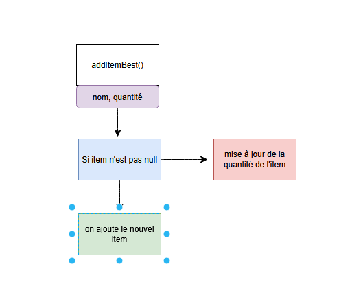

# Méthode avancée

## Fonction stream
fonction Stream pour remplacer une boucle for each :
- items.stream().filter()
- items.stream().sorted()
- items.stream().forEach()
- ...

### exemple avec un stream().filter()

> Voir TP Inventaire Java POO  




```JAVA
    public void addItemBest(String name, int quantity) {
        //Si item existe
        //chercher que ca existe
        // je cherche dans la liste le premier item qui valide la condition "item.name.equals(name)"
        //.orElse = si on ne trouve pas c'est null
        Item foundItem = items.stream().filter((item) -> item.name.equals(name)).findFirst().orElse(null);
        if (foundItem !=null){
            foundItem.quantity += quantity;
        }
        Item newItem = new Item(name, quantity);
    }
```

### remplace la boucle "for" suivante 

```JAVA
    public void addItem(String name, int quantity) {
        for (Item item : items){
            if (Objects.equals(item.name, name)){
                item.quantity += quantity;
                return;
            }
        }        
            items.add(new Item(name, quantity));
            return;
        }
```
## Enum

Pour typer une valeur pour éviter les fautes de frappes par exemple
_Enum transforme le String en int de façon caché_

```JAVA
enum PieceColor {
    Blanche, // 0
    Noire //1
}
class Piece {
    PieceColor color = PieceColor.Blanche; // ou "noire"
}

public static void main(String[] args){
    Piece piece = new Piece();
    piece.color = PieceColor.Noire;
    piece.color = PieceColor.Blanche;

    //Savoir si une piece est noir
    if (piece.color == PieceColor.Noire){

    }
}
```
## Généricité

On veut remplacer un type en temps réel (ex le type d'attribut change en temps réel)

Ex : un attribut de type String peut changer en Int en temps réel ou en Float

1- Mettre un mot qui n'existe pas dans les types "Blop" (la norme c'est de mettre T)
2- on met class Attribute Blop (Dans la norme on met Attribute T)
3- Ce qui donne :
 - Attribute a1 = new Attribute baliseouvrante Integer balise fermante
 - Attribute a1 = new Attribute baliseouvrante String balise fermante

4- S'il y en a plusieurs entre les balises : T, U, V, W... ou autre mot clé du contexte et respecter l'ordre

 ```JAVA
package entrainement;

class Attribute<T, U> {

    public String name;
    public T value;
    public U categorie;
}

public class DemoGenericApp {

    public static void main(String[] args) {

        Attribute a1 = new Attribute<Integer>();
        a1.value = 1;

        Attribute a2 = new Attribute<String>();
        a2.value = "sdsd";

        Attribute a3 = new Attribute<Boolean>();
    }
}

 ```


