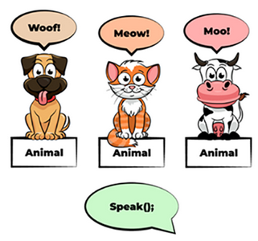

# Rappel S1

## Définition

POO est un paradigme...

## Déclaration / Initialisation

2 étapes dans le code :
    - déclaration
    - initialisation

**Déclaration** :  
Permet de créer des variables et des fonctions
Moment où l'on va réservé un espace mémoire

**Initialisation** ;
Permet d'attribuer des valeurs 
Moment où l'on donne une valeur

## Arguments / Paramètres

**Paramètres** :
Les paramètres d'une fonction sont les noms listés dans la définition de la fonction  
On ne connait pas encore la valeur 

**Arguments** :
Les arguments d'une fonction sont les valeurs réelles passées à la fonction.
Au moment où on execute la methode et on connait la valeur des paramètres.

## Surcharge et redefinittion (@override)

**Méthode surchargée** au sein de la même classe :  
plusieurs fois la même méthode dans une même classe, avec **le même nom** mais avec **des paramètres différents**.

**Méthode redéfinie** (@override) dans la classe enfant :  
une méthode dans **une classe enfant** qui porte **le même nom** et possède **les mêmes paramètres** qu'une méthode de sa classe mère.  
aussi appellée La substitution de méthode

## Constructeur ( c'est une methode)

Fonction qui permet d'instancier un objet  
Il a le meme nom que la classe  
Pas besoin de type de retour
Peut être public, private, protected

Quand on déclare un constructeur il vient écraser celui par défaut.  
Dans la signature l'ordre des paramètres est important

## Signature

La signature d'une méthode comprend le nom de la classe, le nom de la méthode et les types des paramètres.

On peut donc avoir deux methodes du même nom si elle nom pas la même signature  

!

## Encapsulation

scope : portée

private / public / protected

Pourquoi ?

Permet de limiter l'accès pour éviter la modificatinon par erreur en dehors de la classe

**important pour les attributs**
à mettre en private (que la classe) ou en protected (class et ses enfants)

**éviter de mettre les attributs en public**

L'intérêt de la Programmation Orientee Objet est en partie là

l'accès aux attributs n'est pas public, d'où **l'intérêt des getters et les setters** ("qui passe outre le principe d'encapsulation") ne pas le faire par défaut mais réfléchir à pourquoi, va-til être utilisé ?

## Polymorphisme

La capcité d'une methode à changer/ à se comporter différemment en fonction de l'objet (lié à l'hérritage) qui lui est passé

**Le polymorphisme est la capacité à exécuter une même action de différentes manières.**

## Exemple 1 :

Classe parents Forme
Classes enfants Rectangle / rong

méthode : calculersurface() avec une surcharge dans chaque clase enfant (polymorphisme) 

## Exemple 2 :

## Qu'est ce qu'un import ?

shématiquement : c'est comme si on faisait un copié collé/collé de tous le code.