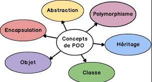

---

sidebar_position: 15

---

Les piliers de la POO :

    **Classes et Objets** : Une Classe est un modèle ou un plan à partir duquel des objets sont créés (comme une recette de cuisine), et un Objet est une instance concrète de cette classe (le gâteau fabriqué à partir de la recette). Chaque objet a des Attributs (ses caractéristiques/données) et des Méthodes (son comportement/ce qu'il peut faire).

    **Encapsulation** : Le principe de cacher les détails internes d'un objet (les attributs) et de n'exposer que ce qui est nécessaire via des méthodes publiques (ex: getters/setters). Cela protège les données et simplifie l'utilisation de l'objet. / private / public / protected

    **Héritage** : Une classe peut hériter des propriétés et des comportements d'une autre classe (la classe parente). Cela favorise la réutilisation du code et l'organisation hiérarchique (ex: un Chien est un type d'Animal, il hérite de ses caractéristiques). Cela va permettre le polymorphisme.

    **Polymorphisme** : La capacité d'un objet à prendre plusieurs formes. Concrètement, cela signifie que vous pouvez traiter différents objets (Chien, Chat) de manière uniforme via leur type commun (Animal), même s'ils ont des implémentations spécifiques pour certaines actions.
        - Surcharge (_overload_ : même nom de méthode mais paramètres différents) - Compilation
        - Redefinition (@override : changer le comportement d'une méthode héritée) - Exécution
        **En bref :** La Surcharge est une affaire de signature dans la même classe. La Redéfinition est une affaire d'héritage entre classes.

    **Abstraction :** Le processus de montrer uniquement les informations essentielles à l'utilisateur et de masquer les détails d'implémentation (en JAVA souvent réalisé via des **interfaces** ou des **classes abstraites**).

Relations entre Classes : Association

    **Agrégation**  : Une relation faible, où l'objet contenu peut exister sans l'objet conteneur.

    **Composition**  : Une relation forte, où l'objet contenu ne peut pas exister sans l'objet conteneur (relation de dépendance forte).

