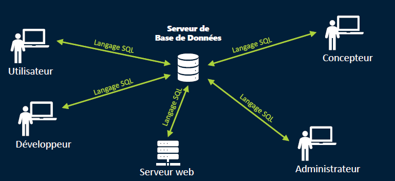
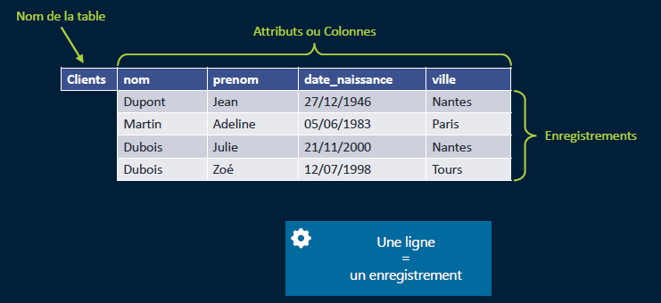
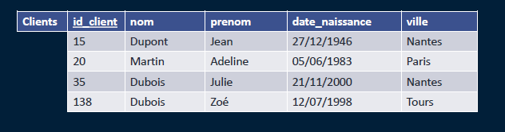
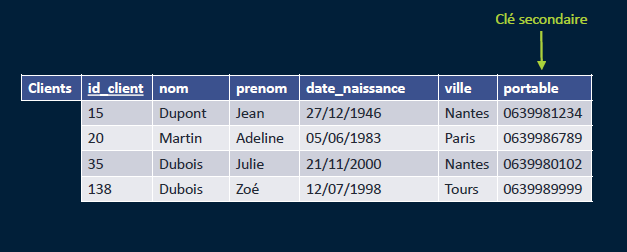
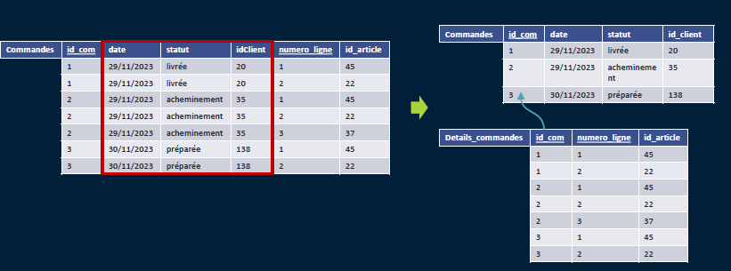

# Le langage de requête SQL avec SQL Server

## Vers les bases de données relationnelles

### Principe de fonctionnement

Structure logique d'organisation des données (tables, vues, index)

Indépendammment de la structure physique

SGBDR : Système de Gestion de Bases de Données Relationnel (ici SQL Server)

C'est le tôle des SGBR de fournir une vue logique des données tout en assurant un stockage physique de celles-ci.

Table :

Une ligne = un enregistrement
Une colonne = une donnée

### CLE PRIMAIRE mot clé PRIMARY KEY

Notion **importante**

    LA CLÉ PRIMAIRE : identifie de manière unique un enregistrement au sein d'une table, une seule clé primaire par table.
    Convention d'écriture : souligné

Clé identifiant technique : si le nom de la clé n'a pas de sens précis

Clé identifiant naturel : le nom a un sens fonctionnel

Clé composite : le couple de valeurs doit être unique ( c'est le binome qui crée la clé)

### CLE SECONDAIRE / mot clé  UNIQUE

- Plusieurs possibles au sein d’une même table
- Peut être non renseignée
- Indexation différente
- L'intégrité référentiel

Une clé secondaire (ou clé alternative, souvent appelée Alternate Key en anglais, d'où l'abréviation AK) est un ensemble d'une ou plusieurs colonnes dans une table qui peut identifier de manière unique chaque enregistrement (ligne), mais qui n'a pas été choisie comme Clé Primaire (PK).

En résumé, c'est une candidate pour être la Clé Primaire, mais qui ne l'est pas.

### LE CARACTERE OBLIGATOIRE

Attribut non renseigné
Mot clé : NULL
Impossible pour un attribut clé primaire

### LES DOMAINE DES VALEURS

Restreindre les valeurs possibles pour un attribut
Ex : statut de livraison (livréé / en préparation / acheminement)
dans les statuts on préfère des codifications 
Ex : Statut de livraison (LI / EP / AC)

### LIER LES LIGNES D'UNE TABLE AVEC LES LIGNES D'UNE AUTRE TABLE

Dans la clé étrangère (foreign key) on va faire référence à la clé primaire

On ne peut pas créer une ligne avec une clé étrangère qui n'existe pas dans la table contenant les clés primaires.

### LA NORMALISATION DES TABLES

Obj : garantir l'utilisabilité et la cohérence des données
5 formes normales
3 formes utilisées dans les faits :

#### LA PREMIERE FORME NORMALE / 1FN

Lorsque toute les colonnes contiennent des valeurs simples (non multiples, non composées)

#### LA DEUXIEME FORME NORMALE / 2FN

Pour l'appliquer il faut que la première forme normale soit mis en place et les colonnes non-clés dépendent fonctionnellement de la clé primaire.

Il faudrait donc créer plusieurs tables

#### LA TROISIEME FORME NORMALE / 3FN

Il faut déjà avoir les deux premières formes mise en place et il n'existe pas de dépendance fonctionnelle entre deux colonnes non-clés primaire.

Autre avantage
Permet d'évite de répéter
ex : ne pas répéter perforateur / 90

### LE SCHEMA DE LA BASE DE DONNEES

Explication flèche retour dans catégorie :

Catégories

    id_categorie	libelle		id_cat_parent
    	1			jardin
    	2			tondeuse		1
    	3			taille haie		1

### LE DICTIONNAIRE DES DONNÉES

Le Dictionnaire des Données est un catalogue centralisé décrivant les métadonnées de la base, détaillant la structure de chaque table, le type de données, les contraintes, et le rôle de chaque attribut.

### Fonction de bases

quatre fonctions de base de SQL (CRUD : Create, Read, Update, Delete), souvent associées aux commandes INSERT, SELECT, UPDATE, et DELETE