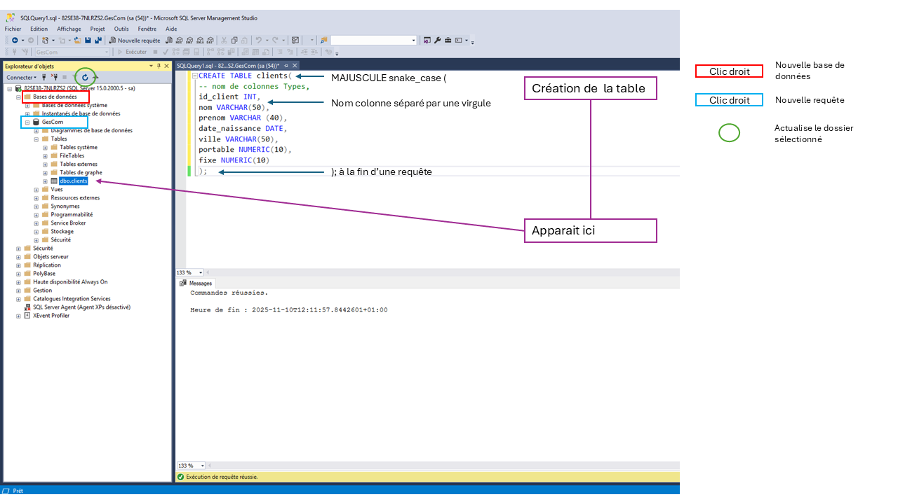
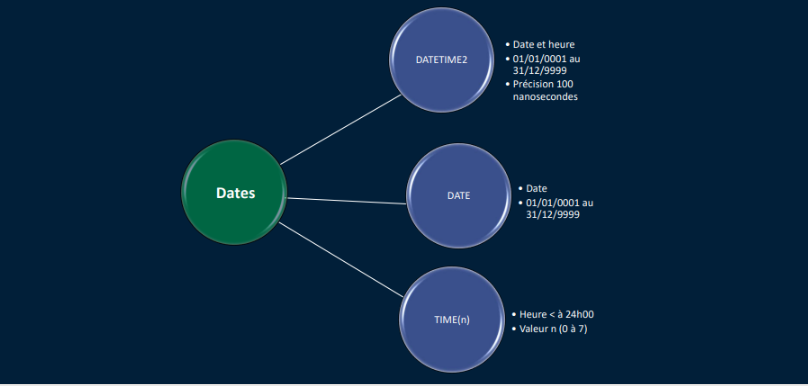
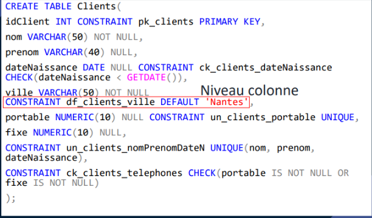
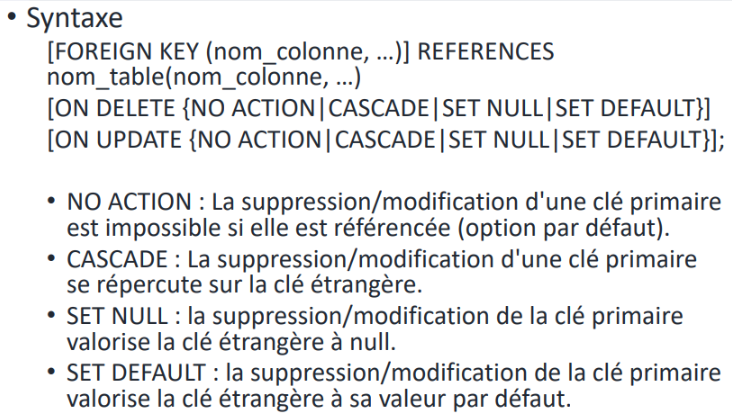
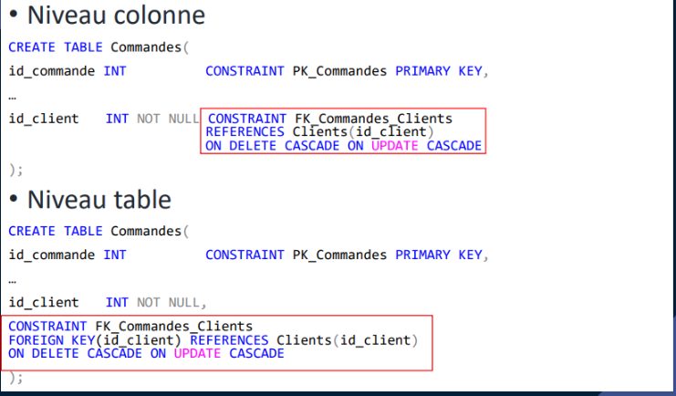
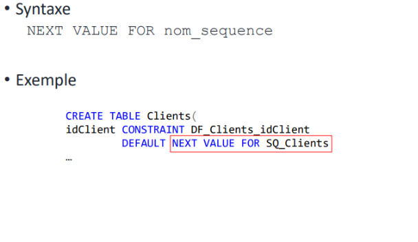

# Le langage de requête SQL avec SQL Server

## DDL : La gestion de la structure de la base de données

Voir l'image pour commencer avec management SQL




### La Création des tables - CREATE TABLE

On termine la requête par un ";"


```SQL
CREATE TABLE clients(
-- nom de colonnes Types,
id_client INT,
nom VARCHAR(50),
prenom VARCHAR (40),
date_naissance DATE,
ville VARCHAR(50),
portable NUMERIC(10),
fixe NUMERIC(10)
);
```

### Convention d'écriture

Les mots clés SQL en majuscules (ex : CREATE TABLE)
Nom des tables au pluriel et en snake_case (ex : Conges_mens)
Nom des colonnes explicites, en minuscule et snale_case(ex : date_modif)
Règles de nommages cohérentes

### Les types de données pour SQL Server

1. Cractère

On utilise surtout CHAR et VARCHAR

2. Numériques

On privilégie le NUMERIC au FLOAT

3. Date


4. Autres


Ce sont les types propriéaire du SGBT de SQL SErver

on utilise pas les standards de la norme pour des questions de perfs.

Pour info :


attention : dernière ligne inversée

### Mise en oeuvre de l'intégrité des données

Objectifs:

- Assurer la cohérence des données
- Appliquer les règles de fonctionnement issues de l'analyse
- Tradutcion des règles du modèle relationnel

Mise en oeuvre

- Attribut requis (NULL = pas OBLIGATOIRE /NOT NULL =  OBLIGARTOIRE)
- Contrainte (CONSTRAINT)
- Déclencheur de base de données (TRIGGER)

CONTRAINTE :

Syntaxe : CONSTRAINT NOM (typeDeContrainte_nomTable[_compementInfos]) TYPE de contrainte

exemple :

```SQL
CONSTRAINT PK_Clients PRIMARY KEY
```


Ces trois mots-clés SQL sont des **contraintes fondamentales**
pour l'intégrité et la cohérence des données

PRIMARY KEY pour clé primaire  | **Unicité**  
UNIQUE pour une clé secondaire | **Unicité**  
CHECK pour vérifier/tester (définit une condition) | **Restreint le Domaine des Valeurs**  
DEFAULT 'mettre valeur par défault'



Exemple :

```SQL
--------demo 1------------
CREATE TABLE Clients(
-- nom de colonnes Types,
	-- Clé Primaire
	id_client		INT	NOT NULL CONSTRAINT PK_Clients PRIMARY KEY,
	nom				VARCHAR(50)	NOT NULL,
	prenom			VARCHAR (40) NULL,
	-- Contrainte d'âge: assure que la personne est née (date antérieure à la date actuelle)
	date_naissance	DATE NULL CONSTRAINT CK_Clients_dateNaissance CHECK (date_naissance < GETDATE()),
	-- Valeur par défaut si non spécifiée
	ville			VARCHAR(50) NOT NULL DEFAULT 'Nantes',
	-- Clé secondaire
	portable		NUMERIC(10) NULL CONSTRAINT UN_Clients_portable UNIQUE,
	fixe			NUMERIC(10) NULL,
	-- Contrainte d'unicité composite (Clé Secondaire)
	CONSTRAINT UN_Clients_nomPrenomDateNaissance UNIQUE (nom,prenom,date_naissance),
	-- Contrainte CHECK : au moins un téléphone doit être renseigné
	CONSTRAINT CK_Clients_telephone CHECK (portable IS NOT NULL OR fixe IS NOT NULL)
);
```

L'intégrité référentiel :

Grâce au Clé étrangère

Définition



Exemple



### MODIFICATION DE TABLE - ALTER TABLE

- Ajouter une Colonne

 ```SQL
ALTER TABLE Articles ADD descritpion VARCHAR(100) NOT NULL;
```

- Modifier une colonne

```SQL
ALTER TABLE Articles ALTER COLUMN descritpion VARCHAR(500) NULL;
```

- Supprimer une colonne

```SQL
ALTER TABLE Articles DROP COLUMN descritpion;
```

### MODIFICATION DES CONTRAINTES - ALTER TABLE

Sera bien adaptée pour les clées étrangères

- Ajouter une Contrainte

 ```SQL
ALTER TABLE Articles 
WITH NOCHECK
ADD CONSTRAINT FK_Articles_Categories
    FOREIGN KEY (ide_categorie);
```

- Supprimer une Contrainte

```SQL
ALTER TABLE Clients DROP CONSTRAINT UN_Clients_portable;
```

- Activer/Désactiver un contrainte (ne s'applique qu'aux contraintes de clés étrangère et de valisation) **PAS UNE BONNE PRATIQUE**

```SQL
ALTER TABLE Articles NOCHECK CONSTRAINT ALL;
```

### Les Valeurs auto-incrémentées

- Identity
  - Génère des valeurs entières
  - Associé à une colonne d'une table
  - Pas nécessairement mais généralement sur la clé primaire
  - 1 seul par table
  - Peut produire des trous dans la numérotation
  - Désactivable/réactivable


- Séquence
  - Génère des valeurs entières
  - Compteur défini indépendamment de toute table
  - Peut être utiliser pour générer des valeurs pour autre chose qu'une colonne

CREATION D'UNE SEQUENCE  


UTILISATION D'UNE SEQUENCE

