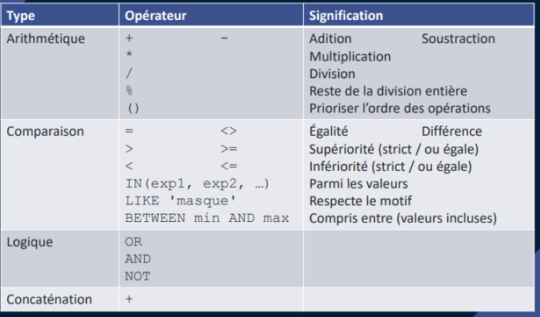
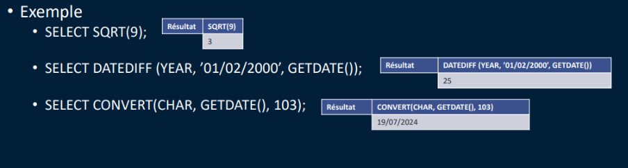
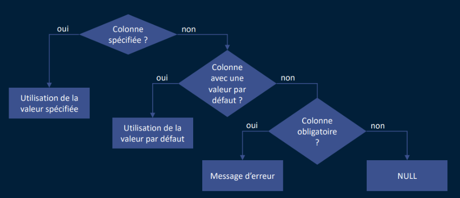
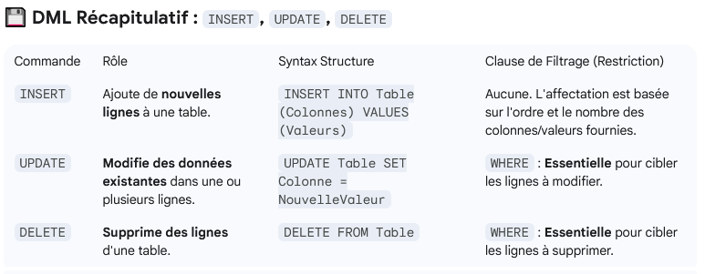

# Le langage de requête SQL avec SQL Server

## DML : La gestion des données

SELECT : Ce que je veux voir (* pour toutes les colonnes)
FROM : d'où ça vient / la table

### Les Littéraux


### Les opérateurs



L'opérateur LIKE :

- Jokers (entre '')
  - _ remplace 1 caractère
  - % remplace un nombre quelconque de caractères **entre 0 et infini**
- Exemples
  - LIKE 'G%' commence par un G
  - LIKE '_x%1' le second caractère est un x et se termine par un 1
  - LIKE '%a%'contient le caractère a 
  - LIKE '%a' se termine par a
  
### Les Fonctions

Transact SQL :

- Agrégation COUNT,SUM,AVG,MIN,MAX
- MAthématique PI,SIN,COS
- Date GETDATE,DATEDIFF
- Chaine de caractère SUBSTRING,TRIM,LOWER,UPPER
- Système COALESCE,NEWID,ROW_NUMBER
- Conversion CONVERT,PARSE
  


### Insérer des données INSERT

Mot clé : INSERT

INSERT INTO : on liste toutes les colonnes a renseigner
VALUES : on indique les données

En respectant dans values l'ordre du INTO


On peut mettre DEFAULT à la place d'une valeur


Il est possible de ne pas rappeler les colonnes mais moins lisibles et moins maintenable


#### Processus d'affectation des valeurs

La question Colonne spécifiée ? concerne ce que l'on trouve dans les parenthèse du INTO



démo :

```SQL
INSERT INTO Clients (nom, prenom, date_naissance, ville, portable, fixe)
VALUES ('DUCHEMIN','Julie','10/09/2001','Paris',0606235208,0240053897);

INSERT INTO Clients (nom, prenom, date_naissance, portable, fixe)
VALUES ('BEAUPLET','Lucas','10/09/1997',0606234508,0240052897);

INSERT INTO Categories (libelle)
VALUES ('Outillage'),
('Jardin');

INSERT INTO Commandes (date_cmd, statut , id_Client)
VALUES(GETDATE(),'EP',15);
```

### Metttre à jour des données UPDATE

Mot clé : UPDATE 
SET : la colonne à changer
WHERE : sert de filtre pour déterminer quelles lignes  seront affectées si elles existent

```SQL
UPDATE Categories SET libelle =UPPER(libelle);

UPDATE Clients SET date_naissance = '20/09/2001' WHERE id_client = 15;
UPDATE Clients SET date_naissance = '18/09/1997', ville='Lyon' WHERE id_client = 15;
UPDATE Clients SET ville='Lyon' WHERE ville = 'Paris' AND date_naissance < '18/09/1997';
```

### Supprimer des données DELETE

Mot clé : DELETE
FROM : la table ciblée
WHERE : sert de filtre pour déterminer quelles lignes  seront affectées si elles existent

```SQL
DELETE FROM Categories;
DELETE FROM Clients WHERE date_naissance <'15/09/1997';

DELETE FROM Clients WHERE id_client = 15;
-- grace au on delete cascade les commandes seront automatiquement supprimées
```

Les commandes **UPDATE et DELETE** sont considérées comme des **opérations dangereuses si elles ne sont pas utilisées avec une clause WHERE** restrictive.



> **Règle d'Or** : Lorsque l'on utilise UPDATE ou DELETE, on commence toujours par écrire la clause WHERE, ou on exécute d'abord un SELECT * FROM Table WHERE [votre condition] pour confirmer les lignes ciblées.

### Transaction et Rollback

Utiliser si on a plusieurs actions à faire pour la même commande par exemple (plusieurs lignes à exécuter)

Mot clé :

- BEGIN TRAN nom_transaction; **Début** de la transaction manuellement : les commandes (INSERT,UPDATE,DELETE) sont mises en attente
- ROLLBACK TRAN nom_transaction; **Annule** retour à l'état avant l'a transaction
- COMMIT TRAN nom_transaction; **Valide** la transaction, les données définitivement
- SAVE TRAN nom_transaction; Déclarer un point de contrôle au sein d'une transaction

Si on ouvre une transaction manuellement **sinon c'est implicite**, 
il faut penser à la refermer

Principes ACID

- Atomique : comme une seule instruction
- Consistant : données cohérentes après la transaction
- Indépendant : données en cours de modification non visibles en dehors de la transaction
- Durée : après la transaction les changements sont durables

```SQL
BEGIN TRAN tran_test; -- transaction "en attente" "avec un verrou"
UPDATE Categories SET libelle =UPPER(libelle);

UPDATE Clients SET date_naissance = '20/09/2001' WHERE id_client = 15;
UPDATE Clients SET date_naissance = '18/09/1997', ville='Lyon' WHERE id_client = 15;
UPDATE Clients SET ville='Lyon' WHERE ville = 'Paris' AND date_naissance < '18/09/1997';

DELETE FROM Categories;
DELETE FROM Clients WHERE date_naissance <'15/09/1997';

DELETE FROM Clients WHERE id_client = 15;

ROLLBACK TRAN tran_test; -- retour dans l'état de la Base de données avant le begin tran

COMMIT TRAN tran_test; -- valide les données définitivement

--réinitialiser l'identity de la tables fiches (ex avec un compeur démarrant à 1000)
DBCC CHECKIDENT ('Fiches', RESEED, 1000);
```
