# Le langage de requête SQL avec SQL Server

## DML : L'extraction de données

Lecture des données en base

### La récupération des données d'une table

Syntaxe :
```SQL
SELECT * FROM Nom_table;
```

Exemple :

```SQL
SELECT * FROM Clients;
```

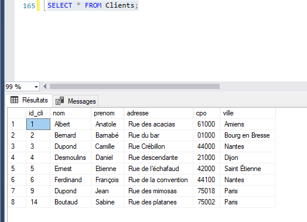

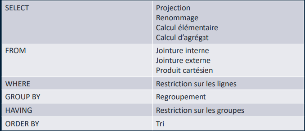

> HAVING lié à GROUP BY : faire des restrictions sur des calculs( fonctions d'agrégat)

Exemple :

```SQL
SELECT nom,prenom,ville FROM Clients;
```

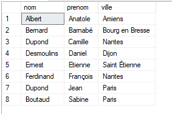

#### SUPPRESSION DES DOUBLONS

DISTINCT : enlever les doublons

```SQL
SELECT DISTINCT nom FROM Clients;
```

#### RENOMAGE pour lecture / Alias

Syntaxe possible :
SELECT nom_colonne AS alias_colonne …
SELECT nom_colonne alias_colonne …
SELECT alias_colonne = nom_colonne

```SQL
SELECT nom nom_de_famille, prenom prénom, ville FROM Clients;
```

#### LES CALCULS ELEMENTAIRES

Calcul effectué pour chaque ligne
SELECT nom_colonne=calcul, … FROM Nom_table;

Exemple :

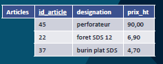

```SQL
SELECT designation, prix_ht, prix_ttc=prix_ht*1.2
FROM Articles;
```

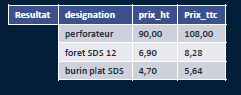


#### LA RESTRICTION


WHEN suivi de notre condition

```SQL
SELECT * FROM Clients WHERE ville = 'Nantes';
```

exemple alias et restriction

```SQL
SELECT UPPER(nom) + ' ' + prenom AS civilite,
DATEDIFF(YEAR, date_naissance, GETDATE()) age FROM Clients WHERE ville='Nantes';
-- PRIX ENTRE 100 ET 150 €
SELECT * FROM Articles
WHERE prix_ht BETWEEN 100 and 150; 
-- habitant à Paris ou Nantes et portable est null
SELECT * FROM Clients
WHERE ville IN ('Nantes', 'Paris') AND portable IS NULL;
-- dont le nom commence par Du
SELECT * FROM Clients
WHERE nom LIKE 'Du%'
-- dans le cas d'un logiciel sensible à la casse
SELECT * FROM Clients
WHERE UPPER(nom) LIKE 'DU%';
-- Clients de moins de 20 ans
SELECT * FROM Clients
WHERE DATEDIFF(YEAR, date_naissance, GETDATE()) < 20;
```

COALESCE
Remplace dans l'affichage un null par "non rensigné" par exemple

```SQL
-- COALESCE POUR REMPLACE NULL
-- CONVERT car pas possible de rempalcer un int par un VARCHAR
SELECT *, age = COALESCE(CONVERT(VARCHAR,(DATEDIFF(YEAR, date_naissance, GETDATE()))),'non renseigné') FROM Clients;
```

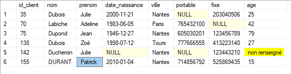

```SQL
-- afficher la table Clients
SELECT * FROM Clients
-- Afficher le nombre de client par année de naissance
SELECT COALESCE(CONVERT(VARCHAR,YEAR(date_naissance)),'non renseigné') annee_naissance, COUNT(*) nbClient FROM Clients
GROUP BY YEAR(date_naissance)
```


#### LES CALCULS D'AGREGAT

Calcul portant sur un ensemble de lignes
COUNT(*) : Nombre de lignes
COUNT(nom_colonne) : Nombre de lignes dont la
colonne passée en paramètre est renseignée
SUM(nom_colonne) : Somme
AVG(nom_colonne) : Moyenne
MIN(nom_colonne) : Minimum
MAX(nom_colonne) : Maximum

Exemple

```SQL
SELECT COUNT(*) nb_articles, MIN(prix_ht) mini, MAX(prix_ht) maxi
FROM Articles;
```

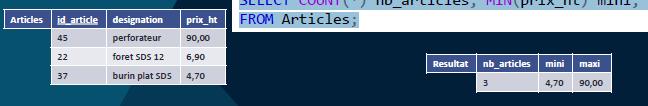

#### LE REGROUPEMENT

GROUP BY :
Permet de regrouper les lignes ayant la même valeur pour une colonnes choisies (ex regroupé par ville)

Les calculs d’agrégat sont alors effectués sur chaque groupe
GROUP BY nom_colonne, …

Exemple :

```SQL
SELECT  ville, COUNT(*) nbClient FROM Clients
GROUP BY ville;
```


```SQL
SELECT COUNT(*) nbArticle, AVG(prix_ht) moyenne FROM Articles
WHERE prix_ht > 20;
```

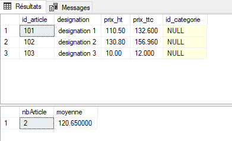

```SQL
SELECT * FROM Details_commandes;

SELECT id_commande, SUM(quantite) nbarticle FROM Details_commandes
GROUP BY id_commande;
```

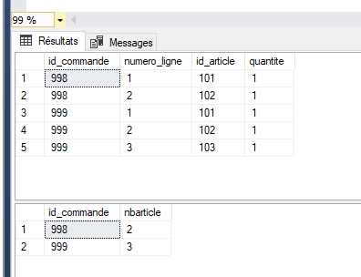

Regroupement et filtre

```SQL
-- récupérer le nombre de client par année de naissance après 2000
SELECT * FROM Clients
SELECT COALESCE(CONVERT(VARCHAR,YEAR(date_naissance)),'non renseigné') annee_naissance, 
COUNT(*) nbClient 
FROM Clients
WHERE date_naissance < '01/01/2000'
GROUP BY YEAR(date_naissance)
```


### JOINTURE (**IMPORTANT**)

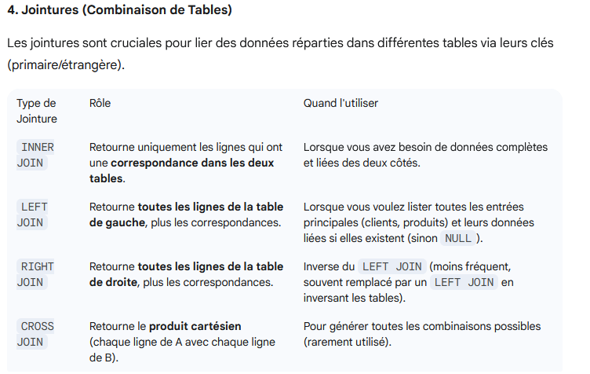

#### LE PRODUIT CARTESIEN (peu utilisé)

Mot clé : CROSS JOIN
Chaque ligne d’une table est mise en correspondance avec
chaque ligne d’une seconde table
FROM Nom_table1 CROSS JOIN Nom_table2

Exemple :

```SQL
SELECT * FROM Clients CROSS JOIN Articles;
```


#### LA JOINTURE INTERNE (très utilisé)

Mot clé : INNER JOIN... ON

mettre en correspondance les lignes de deux tables qui se
correspondent : **FROM** Nom_table1 **INNER JOIN** Nom_table2 **ON** cond

On utilise généralement les clés étrangères pour faire le lien

Exemple :

```SQL
SELECT *
FROM Commandes INNER JOIN Clients
ON Commandes.id_client = Clients.id_client;
```

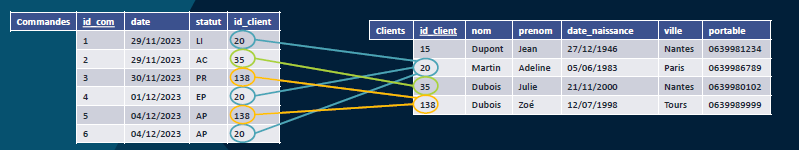

Resultat :

Il faut que la condition de jointure soit strictement vérifé
donc le client 15 n'apparait pas car il n'a pas de commande

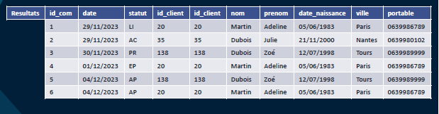

Autre exemple :

```SQL
-- Inner join permet de récupérer seulement les clients qui ont des commandes qui ont des détails qui ont des articles
SELECT nom,prenom,portable,Commandes.id_commande, date_cmd, statut, designation, prix_ht  FROM Clients
INNER JOIN Commandes ON Clients.id_client = Commandes.id_client
INNER JOIN Details_commandes ON Commandes.id_commande = Details_commandes.id_commande
INNER JOIN Articles ON Details_commandes.id_article = Articles.id_article
```

Résultat :

