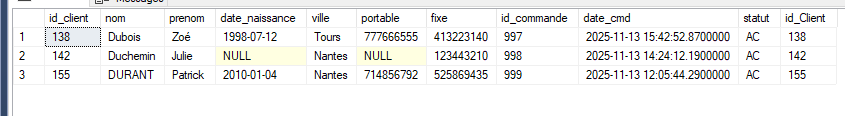
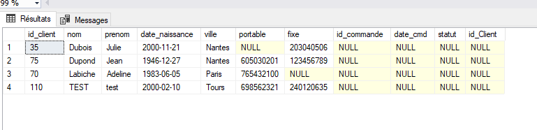
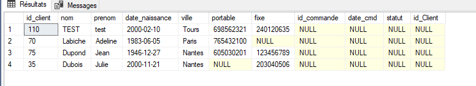

# DEMO JOINTURE et ORDER

> Tous les clients

```SQL
SELECT * FROM Clients
```


> Les clients avec une commande

```SQL
SELECT * FROM Clients
INNER JOIN Commandes ON Clients.id_client = Commandes.id_client
```



> Tous les clients et leurs commmande et ceux sans commande

```SQL
SELECT * FROM Clients
LEFT JOIN Commandes ON Clients.id_client = Commandes.id_client
```


> Les clients n'ayant pas de commande

```SQL
SELECT * FROM Clients
LEFT JOIN Commandes ON Clients.id_client = Commandes.id_client
WHERE id_commande IS NULL
```


> Trier par nom

```SQL
SELECT * FROM Clients
LEFT JOIN Commandes ON Clients.id_client = Commandes.id_client
WHERE id_commande IS NULL
ORDER BY nom
```



> Trier par nom inversé

```SQL
SELECT * FROM Clients
LEFT JOIN Commandes ON Clients.id_client = Commandes.id_client
WHERE id_commande IS NULL
ORDER BY nom DESC
```

