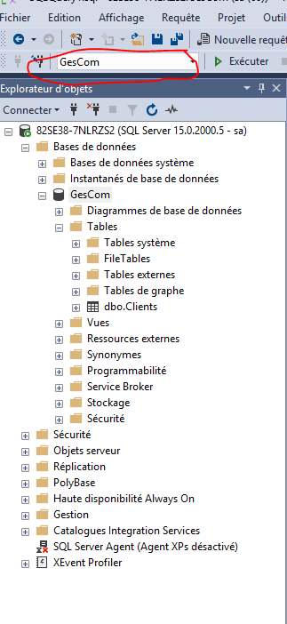
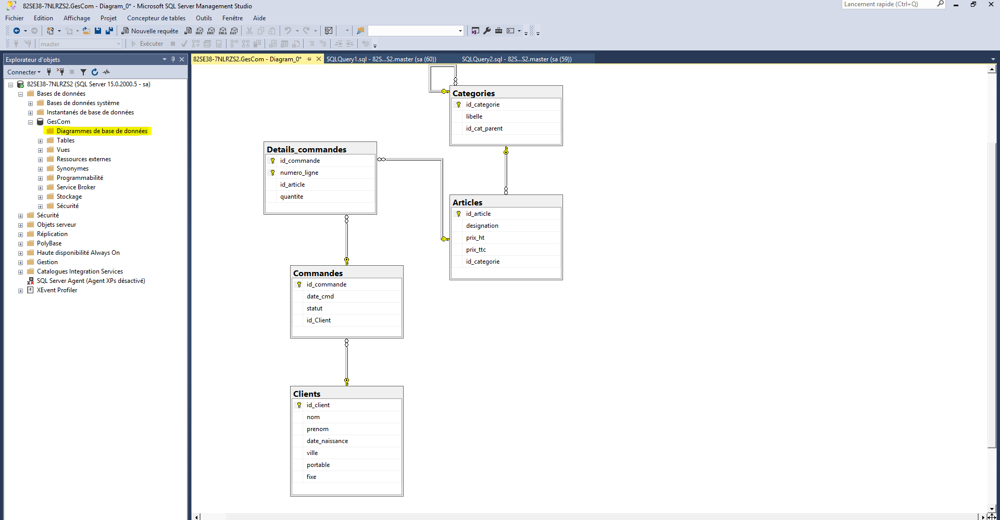

# Utilisation du logiciel

En Sql :

Chaine de caractère : entre simple quote 'mes caractères'

égal : 
```SQL 
IS
```
différent :  
```SQL 
<> 
```

Voir l'image pour commencer avec management SQL




-- Je suis un commentaire

Si on clique sur Exécuter il exécute l'ensemble de la requête.

Execution Sélective
Si on sélectionne une partie et on clique sur Exéucter : il exécute que la sélection

Pour Actualiser :

- Se positionner sur le dossier à Actualiser

Pour générer un diagramme :

- Clic droit sur Diagrammes de base de données


